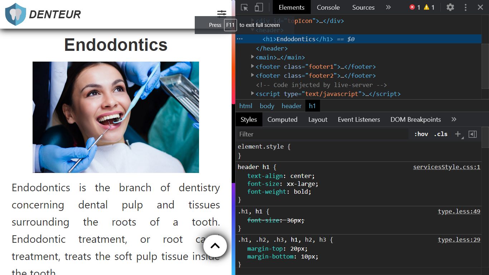

# Denteur
### Contents:
<ul>
<li> Intro</li>
<li> Home</li>
<li> Contact</li>
<li> Services
    <ul>
    <li>Orthodontics</li>
    <li>Endodontics</li>
    <li>Family Dentistry</li>
    </ul>
</li>
</ul>
<h2>Intro<h2>
 It is a dental website, which is made by using html, css, jquery and a little bit of bootstrap and font-awesome icons. It is fully responsive and works well in both desktop and mobile devices.

<h2>Home</h2>

<h2>Contact</h2>

<h2>Orthodontics</h2>

<h2>Endodontics</h2>

<h2>Family Dentistry</h2>

